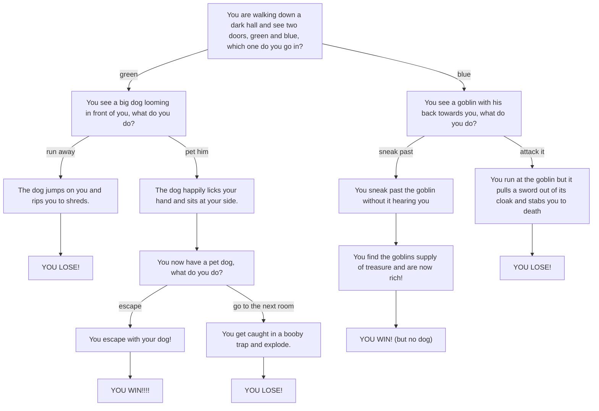

# CHOOSE YOUR OWN ADVENTURE

```mermaid
graph TD;
    start[You are walking down a dark hall and see two doors, green and blue, which one do you go in?]
    dog[You see a big dog looming in front of you, what do you do?]
    run[The dog jumps on you and rips you to shreds.]
    pet[The dog happily licks your hand and sits at your side.]
    goblin[You see a goblin with his back towards you, what do you do?]
    sneak[You sneak past the goblin without it hearing you]
    attack[You run at the goblin but it pulls a sword out of its cloak and stabs you to death]
    dead1[YOU LOSE!]
    dead2[YOU LOSE!]
    level2[You now have a pet dog, what do you do?]
    escape[You escape with your dog!]
    blowup[You get caught in a booby trap and explode.]
    dead3[YOU LOSE!]
    win[YOU WIN!!!!]
    treasure[You find the goblins supply of treasure and are now rich!]
    win2["YOU WIN! (but no dog)"]
    start-->|green|dog
    dog-->|run away|run
    run-->dead1
    dog-->|pet him|pet
    pet-->level2
    level2-->|escape|escape
    escape-->win
    level2-->|go to the next room|blowup
    blowup-->dead3
    start-->|blue|goblin
    goblin-->|sneak past|sneak
    sneak-->treasure
    treasure-->win2
    goblin-->|attack it|attack
    attack-->dead2
```

### Description:
This flowchart provides a simple choose your own adventure story.  
You can either win with a pet dog or treasure.   
All the other paths lose.
